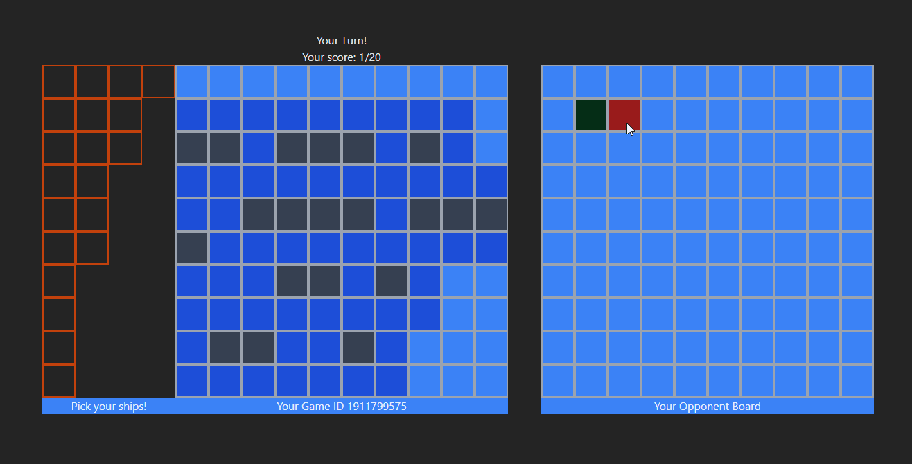

# Simple battleship game - 1v1 multiplayer

## Introduction
I made this simple classic turn based battleship game with a goal to get to know SignalR. Right now based on my newer [QuizGame](https://github.com/mglgw/QuizGame) project I see some potential for upgrades here and there, mostly on fronend side.

---
## Preview



# Used Technologies

- .NET
-  SignalR
-  ReactJs
-  Tailwind
-  Redux Toolkit
## To Do

- [ ] Definitely better design
- [ ] Public lobbies and list of it, so you can play with random players
- [ ] Player vs Bot
- [ ] More things that probably come up while working with previous ones :)

## Getting Started

## Prerequisites

Developed and tested on:
-  Node.js - version 18.16.0
-  Yarn - version 1.22.19
-  .NET 6.0

You can replace Yarn with NPM or PNPM

### First step is to run front:

You can find all instructions in frontend repo [here](https://github.com/mglgw/battleship-game-frontend)

### Second step is to run back

Simply use:
```
dotnet run
```
and wait for app to start hosting.
## GLHF!
